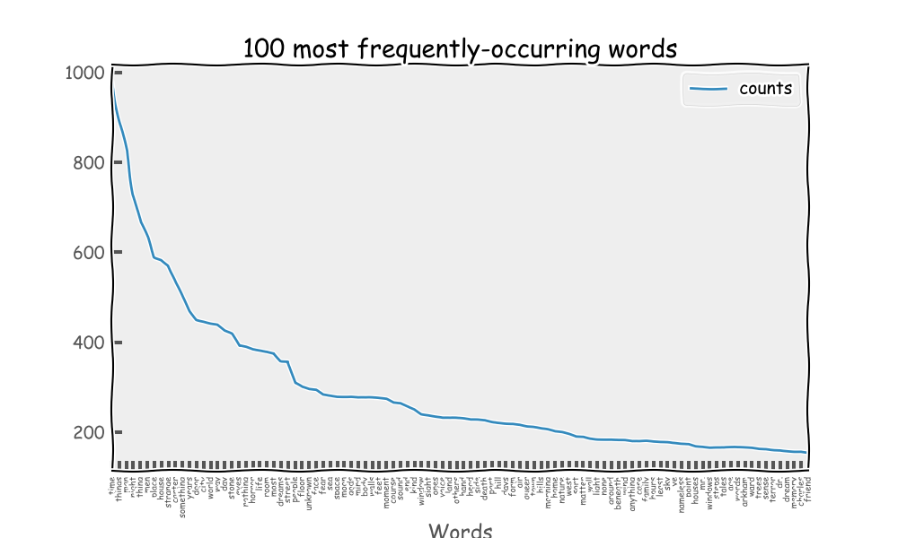

# Classifying and ranking using NLTK and the Nameless Horror

This is a small demo showing basic NLTK functionality (tokenizing, classifying, frequency counting), using [The Collected Works of H.P. Lovecraft](http://gutenberg.net.au/ebooks06/0600031h.html) as a corpus.
The code ought to be fairly self-explanatory.

## Requirements

- Requests
- BeautifulSoup4
- NLTK
- Matplotlib 1.4.x

You may have to install Matplotlib from Github, as 1.4 has not been released as of late July 2013, and you'll need it for the XKCD-style graphs.

## License

MIT, copyright Stephan Hügel 2013

